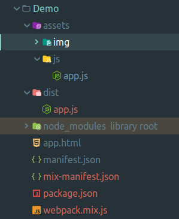

# Firefox extension with VueJS (Part 2)

In the second part of this article, I will show you how to Vueify the extension
we built in the part one using [laravel mix](https://github.com/JeffreyWay/laravel-mix).

## Prerequisites
To follow along in this part you will need nodejs and npm installed.

    $ npm -v
    3.5.2
    $ node -v
    v8.10.0

If you've worked along in the part one, you should now have your extension project
that looks something like this:

The core of our extension is made by a single html file `app.html` and
script in `app.js` that gives our extension some basic functionality.

That means we can use all the tools we are used to when developing regular
website.

If you are not familiar with webpack or laravel mix, don't worry, just follow the steps
I believe you'll catch up once we will get to the vue itself.

Now let's init `package.json` and pull in mix:

    npm init -y
    npm i --save-dev laravel-mix
    
Laravel mix comes with default configuration file so let's copy that to our root directory.

    cp node_modules/laravel-mix/setup/webpack.mix.js .
    
Our extension now looks like this:

If you check laravel mix's [installation guide](https://github.com/JeffreyWay/laravel-mix/blob/master/docs/installation.md),
there are scripts recommended for `package.json` so let's add these too:

    {
        ...
        "main": "app.js",
        "scripts": {
            "dev": "NODE_ENV=development node_modules/webpack/bin/webpack.js --progress --hide-modules --config=node_modules/laravel-mix/setup/webpack.config.js",
            "watch": "NODE_ENV=development node_modules/webpack/bin/webpack.js --watch --progress --hide-modules --config=node_modules/laravel-mix/setup/webpack.config.js",
            "hot": "NODE_ENV=development webpack-dev-server --inline --hot --config=node_modules/laravel-mix/setup/webpack.config.js",
            "production": "NODE_ENV=production node_modules/webpack/bin/webpack.js --progress --hide-modules --config=node_modules/laravel-mix/setup/webpack.config.js"
        },
        "keywords": [],
        ...
    }

Let's do quick cleaning and move the `app.js` into `assets/js` folder. We need to properly
adjust path to `app.js` in `app.html` as well but we'll get to that later.
    
If you open the `webpack.mix.js` file you will see that it contains complete api
available from laravel mix. We will need only one method call and that is the following:

    let mix = require('laravel-mix');
    mix.js('assets/js/app.js', 'dist/');
    
Now if you run

    npm run dev
    
You should see your build passing and `dist` folder should appear in your root folder:

The dist version of `app.js` is the one we will link in `app.html`. Let's do that now
and while in that file, let's clear that file a bit too:

    <!DOCTYPE html>
    <html>
        <head>
            <meta charset="utf-8">
        </head>
        <body>
            

            
        </body>
    </html>

As you can see I removed the button and the list from the part 1.
Only thing we need right now is a wrapper for our vue instance to be mounted on.
Which in this case is the `div` with id `my-app`. Also pay attention to the path
to `app.js` which now correctly points to built version in `dist` directory.

## Vueify!
First, pull in vue as a dependency:

    npm i --save-dev vue

Now we have everything ready to create a vue instance and mount it. Since the `app.js`
is an entry point to our app. Let's do it there. We can completely wipe out the previous
code in there, since it's not that important right now.

Our `assets/js/app.js` will now look something like this

    import Vue from 'vue';
    import App from './components/app.vue'
    
    new Vue({
        el: '#my-app',
        components: {
            App
        },
        render(h) {
            return h('app');
        }
    });
    
We need to take use of vue render function because firefox won't allow vue to inject rendering scripts.
So let's create that root `app.vue` component:

In `assets/js/components/app.vue`:

    <template>
        

            Hello firefox extension. I am Vue!
        

    </template>
    
    
Your project structure should look like this:
    

Don't forget to run `npm run dev` so the changes apply to your javascript.
Or run `npm run watch` and your assets will get compiled automatically every time you make a change.

Test it out and you should see very similar result as in the first part of this article.

Now You've successfully created your second firefox extension.
This time using javascript framework Vue.

Great job!

## Almost there

Actually, this could be the end of this article, because if you know Vue, you can
do pretty much anything you want right now.

But I am gonna show you the functionality from previous part in Vue anyway.
To refresh your memory, we were accessing browsers information about opened tabs in
current window and appending their titles into unordered list.

It's not that complicated, so let's do that.

All our work will be pretty much focused in `app.vue` right now, because there's no
need modifying `app.js`.

First, let's prepare the HTML:

    <template>
        

            <ul class="tab-list">
                <li class="tab-item">This is</li>
                <li class="tab-item">where the tabs</li>
                <li class="tab-item">will come</li>
            </ul>
            <button @click="getTabs()" class="button">Get tabs!</button>
        

    </template>
    
    

This would work, but I am gonna add little bit of styling so it does not look that
default.

    <template>
    ...
    </template>
    
    

So now it looks like this:

This is great, but now the list items are hardcoded. Let's fix that by creating a 
data property with an array of tabs and listing them in template.

    <template>
        

            <ul class="tab-list">
                <li class="tab-item" v-for="tab in tabs">{{ tab }}</li>
            </ul>
            <button @click="getTabs()" class="button">Get tabs!</button>
        

    </template>
    
    
    
Great and now we can finally create a `getTabs` method, that will fetch the tabs
from browser and display them:

    <template>
    ...
    </template>
    
    
    
The `getTabs` method is pretty much the same as in first part of this article but
this time I decided to handle the promise that `query` method returns with async/await
approach.

This is pretty much it. Now you have fully functional firefox extension with vue that
even does something.

In the last section of this article I will show you how to publish your extension.
    
## Publish the extension

First you need to create a single `.zip` archive from your project. Do not include
node_modules directory, which contains only dependencies needed during development and is pretty big.
You don't also need to include `assets/js` folder, because all the necessary scripts have been compiled
into dist folder.

Using terminal I would create a zip archive like this:

    zip -r my-extension.zip app.html assets/img dist manifest.json

This would create a `.zip` archive called `my-extension.zip`

Go to [addons page for developers](https://addons.mozilla.org/en-GB/developers/) on mozzila.org a hit the "Submit a New Add-on" button.

Here you can choose if you want to distribute your extension using Firefox Add-ons Manager
or you choose to distribute it manually.

I'll go with the manual option for now. Submit your archive and you should see if it passed a signing process:

Hit the "Sign Add-on" and you should get to the final step where you can download a single
`.xpi` file, that represents your extension.

Now go to `about:addons` page in firefox, hit the cog wheel on the right and select
**Install Add-on from file**.

Open the `.xpi` file and behold you've successfully installed valid, signed firefox extension built in vue.

And as I promised in the part one of this article. You will get prompted to grant the extension the permission to access tabs.

And this is it.

This article and the demo used in it are [available on Github](https://github.com/DanCharousek/firefox-extension-with-vue) as an opensource
project. So feel free to contribute!

Any question? Let me know on [twitter](https://twitter.com/DanCharousek).
